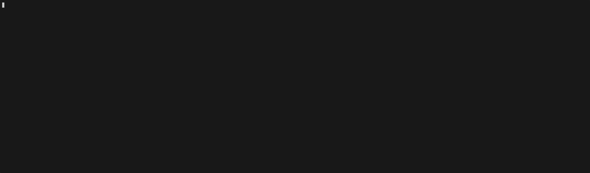

# Skills

[](https://github.com/abuxton/Skills/actions)
[](https://www.npmjs.com/package/@abuxton/skills)
[](https://github.com/abuxton/Skills/blob/main/LICENSE)

Agent skills for GitHub Copilot and other coding agents, built following the
[agentskills.io specification](https://agentskills.io/specification) and
publishable via [skills-npm](https://github.com/antfu/skills-npm).

## Favourite XKCD

[](https://xkcd.com/927/)

My perennial favourite is XKCD #927, "Standards" — which feels especially on-brand for a repository full of reusable tooling and conventions.

## Available Skills

| Name | Description |
| ---- | ----------- |
| [act](skills/act/SKILL.md) | Run, debug, and troubleshoot GitHub Actions locally using nektos/act. |
| [shields-badges](skills/shields-badges/SKILL.md) | Analyse a repository to identify its focus and technology stack, then apply appropriate [shields.io](https://shields.io) badges to markdown files. |
| [tfm-migration](skills/tfm-migration/SKILL.md) | Run a stepped TFE/TFC migration using the [`tfm`](https://github.com/hashicorp-services/tfm) CLI. Orchestrates the full migration workflow across setup, workspace copy, state copy, variable set copy, and finalisation phases. |
| [tfm-migration-setup](skills/tfm-migration-setup/SKILL.md) | Validate a `tfm` configuration file and verify connectivity to source and destination TFE/TFC organisations before starting a migration. |
| [tfm-migration-copy-workspaces](skills/tfm-migration-copy-workspaces/SKILL.md) | Copy workspace definitions (metadata, agent pools, VCS connections, SSH keys) from source to destination using `tfm`. |
| [tfm-migration-copy-state](skills/tfm-migration-copy-state/SKILL.md) | Copy Terraform state files from source workspaces to destination workspaces using `tfm`. |
| [tfm-migration-copy-varsets](skills/tfm-migration-copy-varsets/SKILL.md) | Copy variable sets from source to destination TFE/TFC organisation using `tfm`. |
| [tfm-migration-finalise](skills/tfm-migration-finalise/SKILL.md) | Finalise a migration by locking source workspaces, removing source VCS connections, and verifying the destination using `tfm`. |
| [writing-skills](skills/writing-skills/SKILL.md) | Author high-quality agent skills following the agentskills.io specification, with correct frontmatter, workflow structure, and reference assets. |
| [publishing-npm](skills/publishing-npm/SKILL.md) | Prepare and publish an npm package that ships agent skills, following the skills-npm convention for skill bundling and distribution. |
| [github-gist](skills/github-gist/SKILL.md) | Create, manage, and organize GitHub Gists using the gh and CLI. |
| [gitattributes-manager](skills/gitattributes-manager/SKILL.md) | Create, review, and safely update `.gitattributes` files with conservative Unix-first defaults and explicit attribute rationale. |
| [xkcd-says-what](skills/xkcd-says-what/SKILL.md) | Fetch a matching XKCD comic and generate validated Markdown or HTML embed output for docs or terminal use. |
| [asciinema-record](skills/asciinema-record/SKILL.md) | Record a terminal session to a named .cast file using asciinema, trim the recording to marked content, and optionally convert it to a GIF using agg. |
| [do-nothing-scripting](skills/do-nothing-scripting/SKILL.md) | Derive a do-nothing bash script from an asciinema `.cast` file, a plain text file, shell history output, or a user interview — encoding each step as a manual prompt that the operator can later replace with real automation. |

## Usage



### Via npx (Recommended)

Install the package and symlink the bundled skills using [npx](https://github.com/antfu/skills-npm):

```bash
npx skills -h
> Usage: skills <command> [options]
...

npx skills install @abuxton/skills

```
### Via npm

Install the package and symlink the bundled skills using [skills-npm](https://github.com/antfu/skills-npm):

```bash

npm install @abuxton/skills
npx skills-npm
```

To symlink skills automatically on every `npm install`, add a `prepare` script to your `package.json`:

```json
{
  "scripts": {
    "prepare": "npx skills-npm"
  }
}
```

`skills-npm` creates symlinks at `skills/npm-<package-name>-<skill-name>` in your project. Add this to your `.gitignore` to avoid committing them:

```gitignore
skills/npm-*
```

### Manually

Copy a skill folder to your local `skills/` directory and reference it in your
Copilot prompts, or let the agent discover it automatically.

Each skill folder contains a `SKILL.md` instruction file and optional bundled
reference assets.

## Contributing

See [AGENTS.md](AGENTS.md) for guidance on writing new skills and publishing them via npm.
